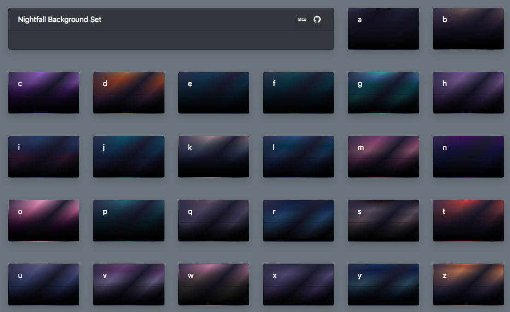
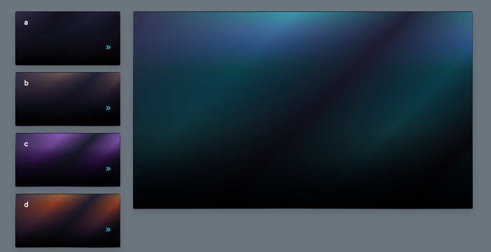

# aficionado
CSS class explorer and preview UI aimed at CSS-gradient backgrounds.

## Demo & Example

- [Browser](https://rawgit.com/fantasyui-com/aficionado/master/index.html)
- [Contact Sheet](https://rawgit.com/fantasyui-com/aficionado/master/demo.html)

